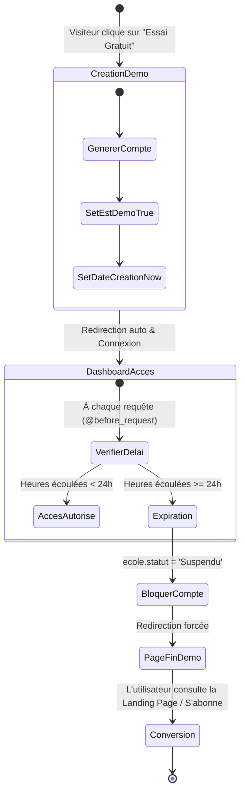

# Flow de la Démo Express (24h)

Ce document décrit le cycle de vie d'un établissement créé en mode "Démo Express".

```mermaid
stateDiagram-v2
    [*] --> CreationDemo : Visiteur clique sur "Essai Gratuit"
    
    state CreationDemo {
        [*] --> GenererCompte
        GenererCompte --> SetEstDemoTrue
        SetEstDemoTrue --> SetDateCreationNow
    }
    
    CreationDemo --> DashboardAcces : Redirection auto & Connexion
    
    state DashboardAcces {
        [*] --> VerifierDelai : À chaque requête (@before_request)
        
        VerifierDelai --> AccesAutorise : Heures écoulées < 24h
        VerifierDelai --> Expiration : Heures écoulées >= 24h
    }
    
    Expiration --> BloquerCompte : ecole.statut = 'Suspendu'
    BloquerCompte --> PageFinDemo : Redirection forcée
    
    PageFinDemo --> Conversion : L'utilisateur consulte la Landing Page / S'abonne
    Conversion --> [*]
```
