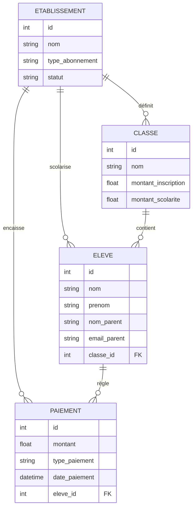
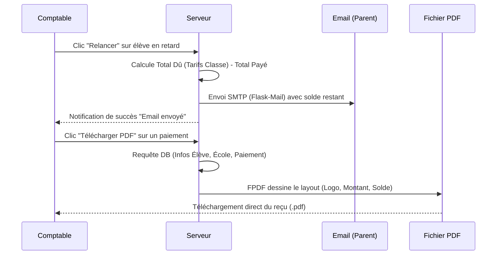

# Architecture ERP ScolariPay

Ce document illustre la structure des données relationnelles pour gérer les classes et les tarifs, ainsi que le flux métier pour les relances par email et l'émission de reçus PDF.

## Modèle de Données (MCD)

## Flux Métier : Relance et Facturation (PDF)

